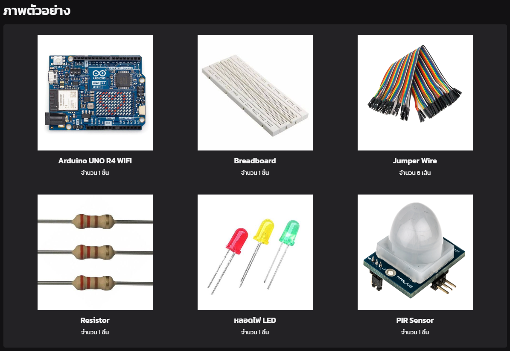
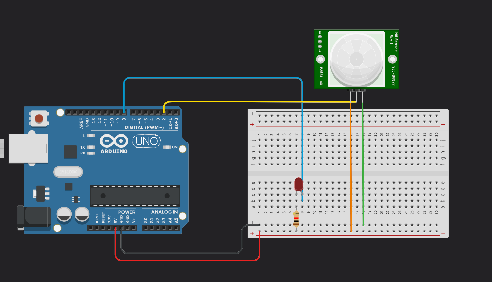

# Physical Computing Project 2024 - IT KMITL

## [Webpage ของโครงงาน](https://pckzy.github.io/Light-on-with-PIR/)

## โปสเตอร์

## [Video ของโครงงาน](https://www.youtube.com/watch?v=3EsJ36GZZ9s)

## บทคัดย่อ
โครงงานนี้มุ่งเน้นการออกแบบและพัฒนาระบบควบคุมไฟฟ้าด้วยเซนเซอร์ตรวจจับคลื่นความร้อน (PIR Sensor) 
โดยใช้ไมโครคอนโทรลเลอร์ Arduino เพื่อให้สามารถเปิด-ปิดไฟได้อัตโนมัติเมื่อมีการเคลื่อนไหวในพื้นที่ที่กำหนด 
โครงงานนี้ยังเพิ่มฟังก์ชันการควบคุมผ่านระบบ WiFi เพื่อให้สามารถสั่งงานเปิด-ปิดไฟผ่านเว็บได้
รวมถึงสามารถเลือกโหมดการทำงานได้ทั้งแบบอัตโนมัติ(PIR sensor) และโหมด Manual
    
## จุดประสงค์
  - เพื่อศึกษาให้เข้าใจหลักการทำงานของไมโครคอนโทรลเลอร์ เช่น Arduino ในการควบคุมอุปกรณ์อิเล็กทรอนิกส์
    
  - เพื่อศึกษาวิธีการทำงานของ PIR Sensor ในการตรวจจับคลื่นอินฟราเรดที่ออกมาจากสิ่งมีชีวิต โดยเฉพาะการตรวจจับการมีอยู่ของคน
    
  - เพื่อฝึกการวิเคราะห์และแก้ไขปัญหาการทำงานของวงจร ตรวจสอบและแก้ไขปัญหาที่อาจเกิดขึ้นระหว่างการต่อวงจรและการทำงานของระบบ

## ประโยชน์ของโครงงาน
โครงงานนี้ช่วยให้ผู้ใช้สามารถควบคุมและตรวจสอบไฟที่บ้านหรือสถานที่ทำงานได้อย่างสะดวกสบายยิ่งขึ้น โดยไม่ต้องเปิด-ปิดไฟด้วยตัวเอง 
ลดการสิ้นเปลืองพลังงานไฟฟ้าเมื่อไม่มีการใช้งาน เนื่องจากระบบจะทำการลดไฟอัตโนมัติเมื่อไม่มีพบสิ่งมีชีวิตในพื้นที่ที่กำหนด 
และยังมีการควบคุมผ่านระบบ WiFi ทำให้เพิ่มความสะดวกสบายและความยืดหยุ่นในการใช้งาน

## รายละเอียด
  เมื่อ PIR Sensor ตรวจพบคลื่นความร้อน (เมื่อมีคนเข้ามาในรัศมี) จะส่งสัญญาณไปยังไมโครคอนโทรลเลอร์ ซึ่งจะทำการเปิดไฟ\
  แล้วเมื่อคนออกจากรัศมีไฟจะดับลง นอกจากนี้ยังสามารถเปิดปิดไฟผ่านเว็บได้

  **เตรียมอุปกรณ์**
  - Arduino UNO R4 WIFI
  - PIR Sensor
  - หลอดไฟ LED สีเขียว
  - สายไฟ และ Breadboard
  - ตัวต้านทาน (ตามค่าที่เหมาะสม)

    

**ภาพตัวอย่างการต่อวงจร**
    

  **สร้างวงจร**
  - การเชื่อมต่อ PIR Sensor: ทำการเชื่อมต่อ PIR Sensor โดยใช้พอร์ตที่ถูกต้องบน Arduino
  - ป้องกัน LED ด้วย Resistor: ใช้ resistor ต่อกับ LED เพื่อป้องกันหลอดไฟเสียหาย

  **เขียนโปรแกรมใน Arduino IDE**
  - มีการสร้างการเชื่อมต่อผ่าน WiFi
  - การสร้างเว็บ
    - ออกแบบหน้าเว็บด้วยการเพิ่มปุ่มสำหรับการควบคุมการทำงานในแต่ละโหมด
    - เพิ่มหน้าต่างแสดงสถานะปัจจุบันของ LED และ โหมดที่ใช้งานอยู่
  - โหมด PIR ใช้ตรวจจับคลื่นอินฟราเรดหากไม่พบจะลดพลังงานลงครึ่งนึงเพื่อประหยัดพลังงาน
  - โหมด Manual ผู้ใช้จะสามารถสั่งการ เปิด - ปิด LED ได้เองผ่านเว็บเพื่อความยืดหยุ่นในการใช้งาน

  **ทดสอบการทำงาน**
  - ทดสอบแต่ละฟังก์ชันอย่างละเอียด เช่น เปิด LED, สลับโหมด และการเปลี่ยนความสว่างในโหมด PIR
  - ตรวจสอบการทำงานของหน้าเว็บ (HTML + JavaScript) บนเบราว์เซอร์หลายตัวเพื่อให้มั่นใจว่าจะไม่มีปัญหาเมื่อทำงานพร้อมกัน
## 🤝 สมาชิกผู้จัดทำ
| ชื่อ - นามสกุล | รหัสนักศึกษา |
| -------- | ------- |
| นายกิตติพศ มงคลรัตน์ | 66070239 |
| นายชนกชนม์ แผ่นคำ | 66070247 |
| นายศรัณย์ มั่นประพันธ์ | 66070309 |
